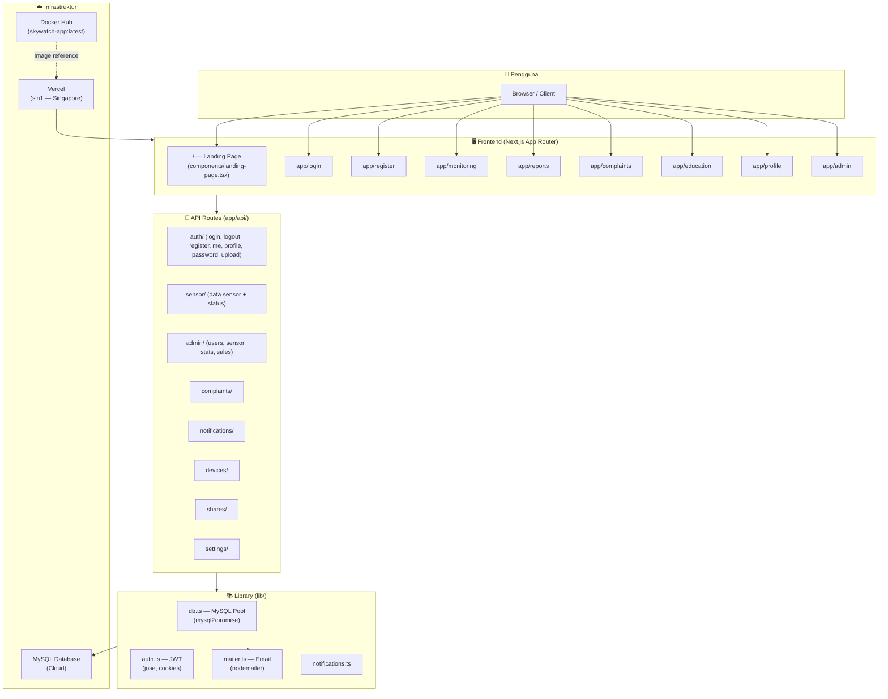
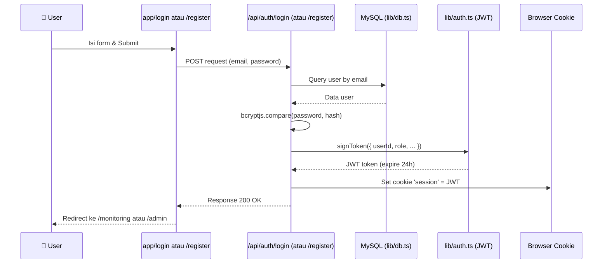
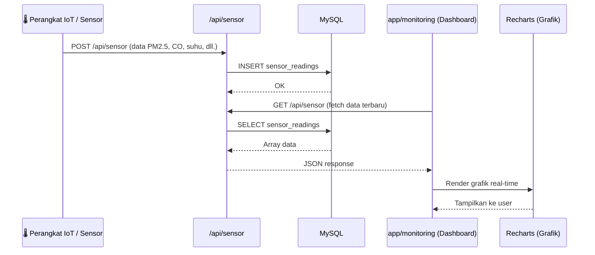
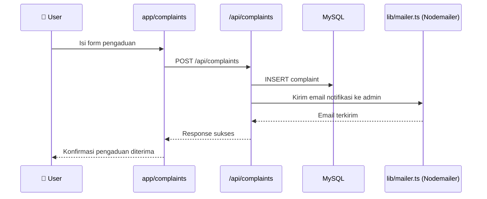
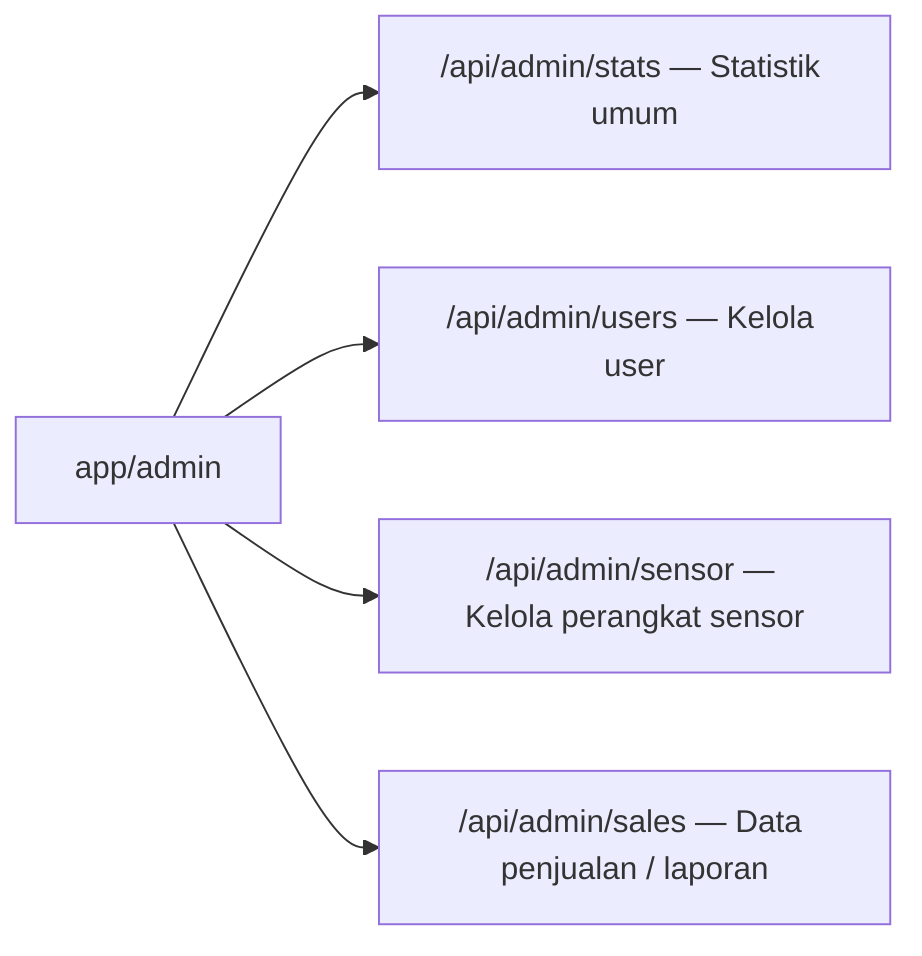
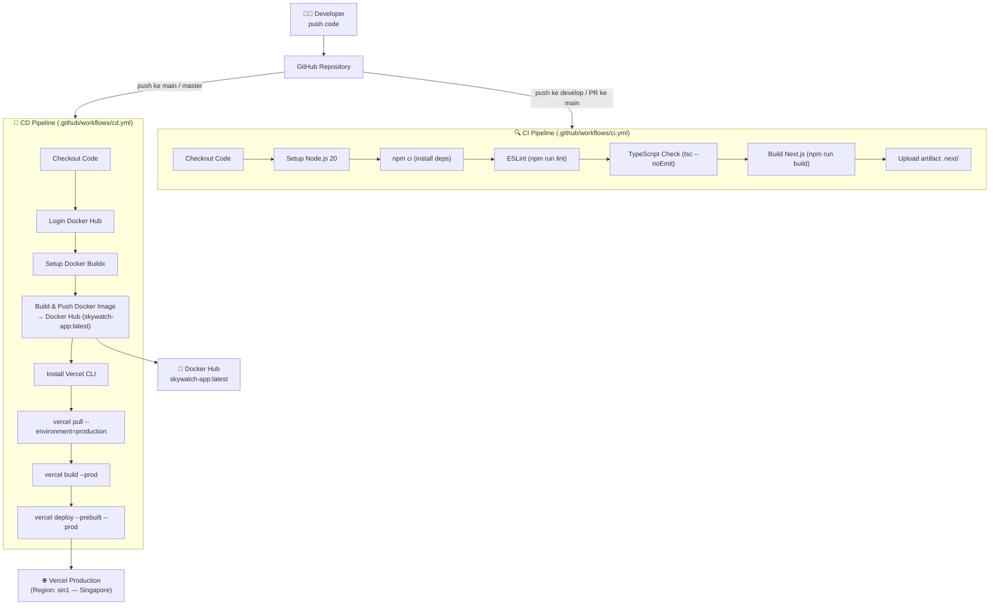

# 🌤️ SkyWatch — Alur Program (Workflow Overview)

Proyek ini adalah **Next.js 16** full-stack web app bernama **SkyWatch** — dashboard pemantauan kualitas udara berbasis IoT, dengan pipeline CI/CD ke Docker Hub + Vercel.

---

## 1. Arsitektur Keseluruhan

---

## 2. Alur Autentikasi (Login / Register)

> **Auth library:** `jose` (JWT) + `bcryptjs` (hash password) + Next.js `cookies()`

---

## 3. Alur Data Sensor (IoT → Dashboard)

---

## 4. Alur Pengaduan (Complaints)

---

## 5. Alur Admin Panel

> Semua endpoint `/api/admin/*` dilindungi oleh verifikasi JWT + pengecekan `role === 'admin'`

---

## 6. Alur CI/CD (DevOps Pipeline)

---

## 7. Ringkasan Stack Teknologi

| Layer | Teknologi |
|---|---|
| **Framework** | Next.js 16.2.3 (App Router) |
| **UI** | React 19, Tailwind CSS v4, Recharts, Lucide React |
| **Database** | MySQL (via `mysql2/promise`, connection pool) |
| **Autentikasi** | JWT (`jose`) + bcryptjs + Cookie session |
| **Email** | Nodemailer |
| **CI/CD** | GitHub Actions (CI: lint+build, CD: Docker+Vercel) |
| **Deployment** | Vercel (Singapore), Docker Hub (image backup) |
| **Bahasa** | TypeScript |

---

## 8. Halaman / Fitur yang Ada

| Route | Fungsi |
|---|---|
| `/` | Landing page publik (SkyWatch intro) |
| `/login` | Login user |
| `/register` | Registrasi user baru |
| `/monitoring` | Dashboard data kualitas udara real-time |
| `/reports` | Laporan historis |
| `/complaints` | Form pengaduan |
| `/education` | Konten edukasi kualitas udara |
| `/profile` | Profil user |
| `/admin` | Panel admin (user, sensor, statistik) |
